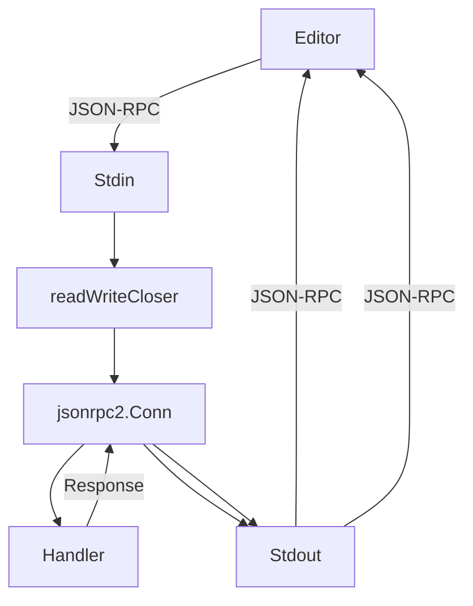

# Architecture: fle-lsp

## Overview
This project implement the Language Server Protocol (LSP) for Fast Log Entry (FLE) files using a modular Go approach.

## Tech Stack
- **Language**: Go
- **LSP Framework**: [go.lsp.dev](https://github.com/go-lsp/protocol) (specifically `jsonrpc2` and `protocol` packages).

## Project Patterns
- **Logging**: Use the `zap` logger provided in the `Handler` struct. Avoid naked `fmt.Print` calls.
- **Error Handling**: Bubble errors up to the handler methods where they can be logged or returned as LSP error codes.
- **LSP Methods**: Maintain a clean `Handler` struct.
- **FLE Models**: Use domain-driven naming for FLE concepts (e.g., `QSO`, `Header`, `LogEvent`, `Band`, `Mode`).

## Server Lifecycle
1. **Entry Point**: `cmd/main.go` initializes a logger and calls `flelsp.StartServer`.
2. **Transport**: `server.go` wraps `os.Stdin` and `os.Stdout` into a `readWriteCloser` for JSON-RPC communication.
3. **Dispatch**: The `protocol.ServerHandler` routes LSP methods to the `Handler` defined in `handlers.go`.

## Key Components
- [server.go](file:///home/loic/projets/fle-lsp/server.go): Connection setup and stream management.
- [handlers.go](file:///home/loic/projets/fle-lsp/handlers.go): Business logic for LSP methods (Hover, Completion, Document Symbols, Semantic Tokens).
- [parser.go](file:///home/loic/projets/fle-lsp/parser.go): Stateful FLE parser implementation.
- [models.go](file:///home/loic/projets/fle-lsp/models.go): Domain models (QSO, Token, etc.).

## Parsing Strategy
FLE is line-oriented and stateful. The parser will process documents line-by-line, maintaining a state object to track the active date, band, and mode. Shorthand times will be expanded based on the previous QSO's time.

## Advanced Features

### FoldingRanges
Uses a hierarchical strategy to group log entries by Year, then Month, then Day. This allows users to collapse entire sections of their logbook based on the chronological structure of FLE files.

### Formatting (Full & Range)
Implemented via a shared `normalizeLine` path. `RangeFormatting` applies this logic selectively to specific line indices, providing high-performance formatting without re-scanning the whole file.

## Design Patterns & Lessons Learned

### Command & UI Orchestration
When implementing LSP commands (e.g., `fle.convertGeoJson`):
- **Conflict Prevention**: Avoid registering the same command ID in both the editor extension (client-side) and the server's `ExecuteCommandProvider`. This causes "command already exists" errors in VS Code.
- **Delegation Pattern**: Use a UI-specific command ID (e.g., `fle.convertGeoJsonUI`) in the editor's command palette that captures context (like the active document URI) and delegates execution to the server's LSP command.

### Dynamic File Handling (`showDocument`)
To open a file side-by-side from the server:
- **Capability Guard**: Always check `params.Capabilities.Window.ShowDocument.Support` during `Initialize`.
- **LSP-Native Flow**: Prefer `window/showDocument` for standard-compliant editors (VS Code, etc.).
- **Message Fallback**: For editors that don't support `showDocument` (e.g., Zed), fall back to `window/showMessage` to inform the user that the file was successfully created on disk.
